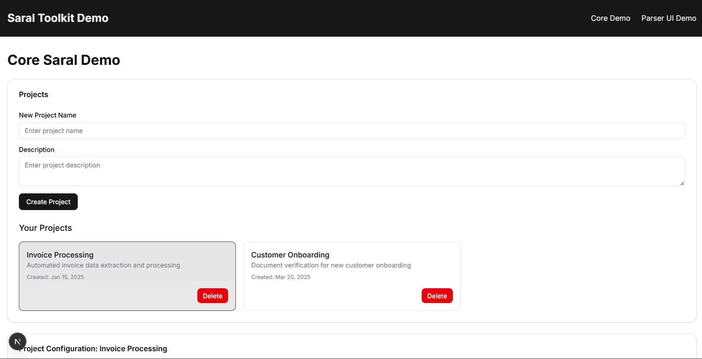
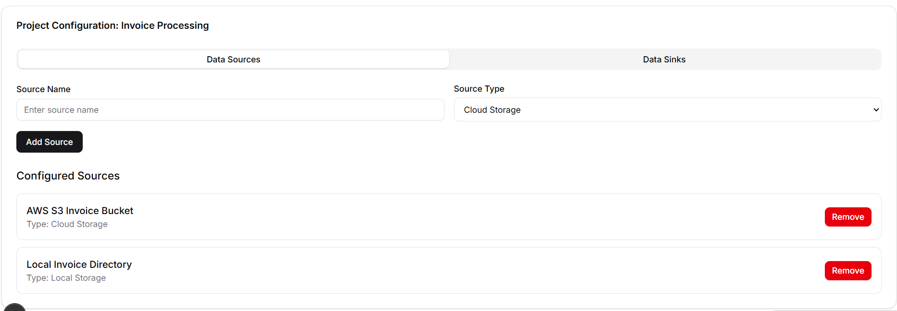
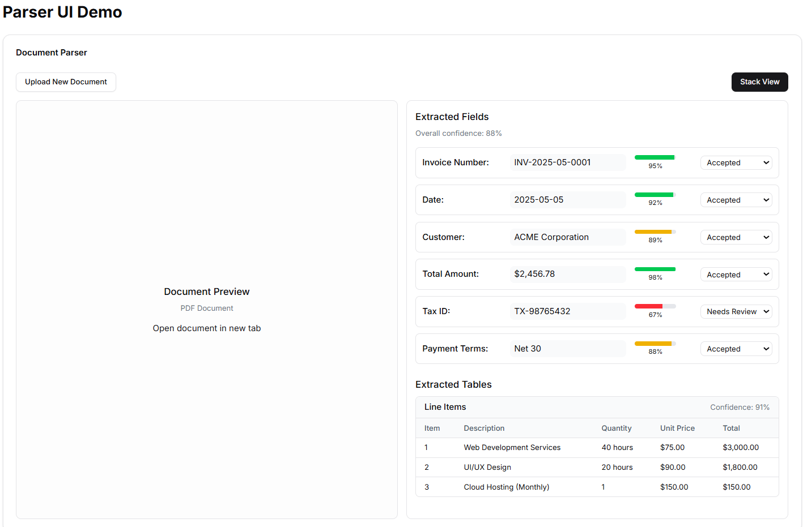

# Saral Toolkit


<!-- Three images in one row, centered with equal spacing -->
<div style="display: flex; justify-content: center; align-items: center; gap: 20px;">
  
  <!--  -->
  
</div>

<!-- Two NPM package badges in one centered row -->
<div align="center">
  <div style="display:inline-block; margin:0 10px; text-align:center;">
    <a href="https://www.npmjs.com/package/core-saral">
      
    </a>
    <div>core-saral</div>
  </div>
  <div style="display:inline-block; margin:0 10px; text-align:center;">
    <a href="https://www.npmjs.com/package/parser-ui">
      
    </a>
    <div>parser-ui</div>
  </div>
</div>


## 📚 Table of Contents

- [Overview](#overview)
- [Repository Structure](#repository-structure)
- [Published NPM Packages](#published-npm-packages)
  - [@saral/core](#saralcore)
  - [@saral/parser-ui](#saralparser-ui)
- [Demo Application](#demo-application)
- [Getting Started](#getting-started)
  - [Prerequisites](#prerequisites)
  - [Installation](#installation)
  - [Development Workflow](#development-workflow)
- [Usage](#usage)
- [API Reference](#api-reference)
- [Deployment](#deployment)
- [Contributing](#contributing)
- [License](#license)

## Overview

Saral Toolkit focuses on building foundational frontend modules for document processing applications. The toolkit provides:

- Project management interfaces for creating and configuring projects
- Source and sink configuration for data ingestion and storage
- Document parsing and visualization components
- Feedback collection interfaces for improving extraction accuracy

The project is structured as a monorepo containing two publishable NPM packages and a demo application that showcases the capabilities of these packages.


## Repository Structure

```plaintext
saral-toolkit/
├── packages/
│   ├── core-saral/          # Core project management components
│   ├── parser-ui/           # Document parsing and visualization components
│   └── saral-next-demo/     # Next.js demo application
├── lerna.json               # Lerna configuration
├── package.json             # Root package.json for monorepo management
└── README.md                # This file
```
## Packages

### core-saral

[](https://www.npmjs.com/package/@saral/core)

Core components for project management, source/sink configuration, and data capture workflows.

**Key Features:**
- Project creation and management
- Data source configuration (cloud storage, local storage)
- Data sink configuration (databases, API endpoints)
- Capture configuration for document ingestion

**Installation:**

```bash
npm install core-saral
# or
yarn add core-saral
```

#### Basic Usage

```tsx
import { useProject } from 'core-saral';

function ProjectManagement() {
  const { projects, createProject, deleteProject } = useProject();

  const handleCreate = () => {
    createProject({ name: 'Invoice Processing', description: 'Process invoices' });
  };

  return <div>{/* UI here */}</div>;
}
```


### parser-ui

Components for document parsing, visualization, and feedback collection.

#### Key Features

* Drag-and-drop document uploader
* Viewer for PDFs, images, and Word documents
* Parsed results panel with editing and validation
* Feedback collection interfaces

#### Installation

```bash
npm install parser-ui
# or
yarn add parser-ui
```

#### Basic Usage

```tsx
import { DocumentUploader, ParsedResultsPanel } from 'parser-ui';

function ParserDemo() {
  const handleFile = (file: File) => {
    // parse file
  };

  return (
    <div>
      <DocumentUploader onFileSelect={handleFile} />
      {/* Show ParsedResultsPanel when data exists */}
    </div>
  );
}
```

### Demo App 

A Next.js application showcasing the Saral Toolkit with Tailwind CSS and Shadcn UI.

#### Features

* Core project management demos
* Parser UI integration examples
* Responsive design

---

## Getting Started

### Prerequisites

* Node.js (v16+)
* npm (v7+) or Yarn (v1.22+)
* Git

### Installation

1. **Clone the repo**

   ```bash
   git clone https://github.com/yourusername/saral-toolkit.git
   cd saral-toolkit
   ```

2. **Install dependencies**

   ```bash
   # npm
   npm install

   # yarn
   yarn install
   ```

3. **Build packages**

   ```bash
    # Build all packages
    npx lerna run build

    # Build specific package
    npx lerna run build --scope=@saral/core
    npx lerna run build --scope=@saral/parser-ui

    # Build multiple packages
    npx lerna run build --scope="{@saral/core,@saral/parser-ui}"
   ```

### Development Workflow

```bash
# Run demo app
cd packages/saral-next-demo
npm run dev
# or
yarn dev
```


---

## Usage

Import and integrate components and hooks from `core-saral` and `parser-ui` in your React projects.


## Deployment

### Publishing Packages

```bash
npm login
npx lerna publish
```


## Contributing

1. Fork the repo
2. Create a branch
3. Commit changes
4. Open a PR

